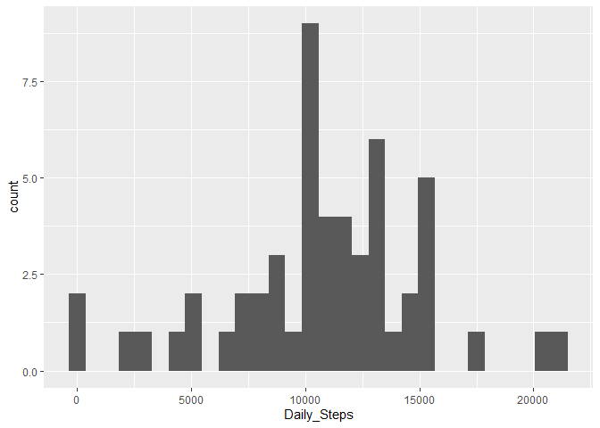
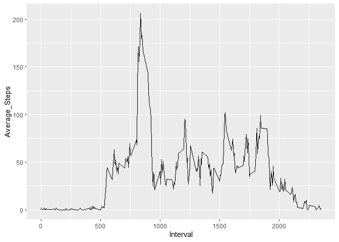
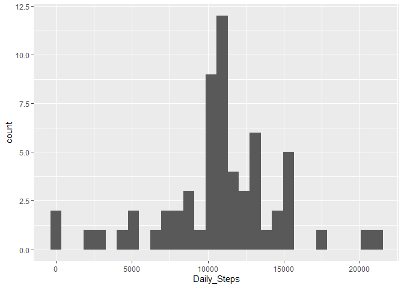
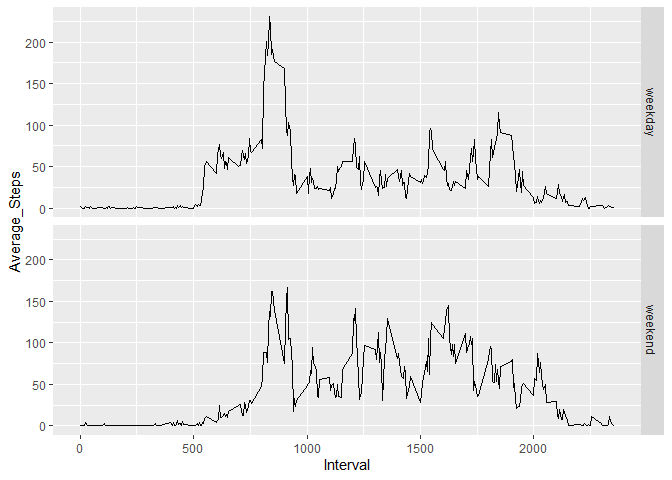

## Loading and preprocessing the data

Load libraries

```r
library(dplyr)
```

```
## 
## Attaching package: 'dplyr'
```

```
## The following objects are masked from 'package:stats':
## 
##     filter, lag
```

```
## The following objects are masked from 'package:base':
## 
##     intersect, setdiff, setequal, union
```

```r
library(ggplot2)
```

Unzip the data because it is zipped in the repository.
This is commented out so that it is not run during document generation.


```r
#unzip("activity.zip")
```

Read the data, setting the column names


```r
activity <- read.csv("activity.csv", col.names = c("Steps", "Date", "Interval"))
```

## What is mean total number of steps taken per day?

Calculate the total for each day.


```r
daily <- activity %>%
    group_by(Date) %>%
    summarize(Daily_Steps = sum(Steps))
```

Create a histogram.


```r
plot1 <- ggplot(daily, aes(Daily_Steps)) + geom_histogram(na.rm = TRUE)
suppressMessages(print(plot1))
```

<!-- -->

Determine mean and median

Mean steps per day


```r
mean(daily$Daily_Steps, na.rm = TRUE)
```

```
## [1] 10766.19
```

Median steps per day


```r
median(daily$Daily_Steps, na.rm = TRUE)
```

```
## [1] 10765
```


## What is the average daily activity pattern?

We average the number of steps by time intervals across all days.


```r
interval <- activity %>%
    group_by(Interval) %>%
    summarize(Average_Steps = mean(Steps, na.rm = TRUE))
```

We provide a time series plot of these data.


```r
ggplot(interval, aes(Interval, Average_Steps)) + geom_line(na.rm = TRUE)
```

<!-- -->

Interval with maximum average steps


```r
maxintv <- which.max(interval$Average_Steps)
print("")
```

```
## [1] ""
```

```r
interval$Interval[maxintv]
```

```
## [1] 835
```

Average steps for this interval


```r
interval$Average_Steps[maxintv]
```

```
## [1] 206.1698
```


## Imputing missing values

First we determine which columns have missing values.

Total rows


```r
nrow(activity)
```

```
## [1] 17568
```

Missing steps


```r
nrow(filter(activity, is.na(Steps)))
```

```
## [1] 2304
```

Missing dates


```r
nrow(filter(activity, is.na(Date)))
```

```
## [1] 0
```

Missing intervals


```r
nrow(filter(activity, is.na(Interval)))
```

```
## [1] 0
```

We fill the missing steps with the averages for the intervals as calculated previously.


```r
a1 <- inner_join(activity, interval, by = "Interval")
a1$Steps[is.na(a1$Steps)] <- a1$Average_Steps[is.na(a1$Steps)]
```

Then we summarize to get new daily totals and print a new histogram.


```r
daily2 <- a1 %>%
    group_by(Date) %>%
    summarize(Daily_Steps = sum(Steps))
```


```r
plot2 <- ggplot(daily2, aes(Daily_Steps)) + geom_histogram(na.rm = TRUE)
suppressMessages(print(plot2))
```

<!-- -->

We look at the impact of filling in the data on the mean and median.

Mean

```r
mean(daily2$Daily_Steps, na.rm = TRUE)
```

```
## [1] 10766.19
```
Median

```r
median(daily2$Daily_Steps, na.rm = TRUE)
```

```
## [1] 10766.19
```

The mean has not changed, and the median changed only slightly.


## Are there differences in activity patterns between weekdays and weekends?

We add a new column (Weekpart) to separate the weekends from the week days.


```r
weekend <- c("Sat", "Sun")

weektime <- mutate(a1, Weekpart = weekdays(as.Date(Date), abbreviate = TRUE),
                   Weekpart = if_else(Weekpart %in% weekend, "weekend", "weekday"),
                   Weekpart = as.factor(Weekpart))

interval_wt <- weektime %>%
    group_by(Weekpart, Interval) %>%
    summarize(Average_Steps = mean(Steps, na.rm = TRUE))
```

Then we create plots to compare the two sets.


```r
ggplot(interval_wt, aes(Interval, Average_Steps)) + geom_line(na.rm = TRUE) + facet_grid(Weekpart ~ .)
```

<!-- -->
